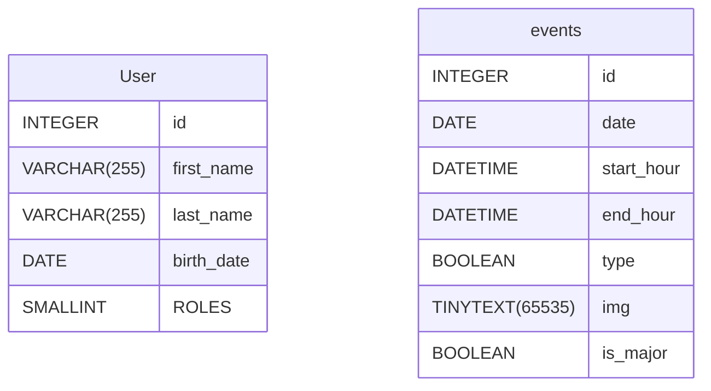

# Livrable

## Consigne 
https://www.figma.com/deck/7c0aFzSlq14nO5Lt63DioP/M4D24-%2F%2F-DEVDAYS?node-id=1-25&node-type=canvas&viewport=25%2C647%2C0.07&t=n7cUTjuPAcTQsfZJ-1&scaling=min-zoom&content-scaling=fixed&page-id=0%3A1

## Context
Projet réalisation d'une appliation web responsive pour la gestion d'un festival. 
On devra trouver un theme, développé une partie front end et avoir une solution avec des rest api pour la partie backend.
On doit égalment créer une maquette avec une identité visueul en adéquation avec le thème du festival.

## Fonctionnalité attendu
### Disposer d'une liste d'évènement
### Possibilité aux utilisateurx de lister les évenements
### Voir les détails d'un evenement
- Décrit une activé ou le concert d'un artiste avec une heure
### Carte interactive
Avoir une carte pour indiqué le lieu du festival

### Attente de l'API
- CRUD sur le évènement
  

## Groupe
- Maxence B
- Louis
- Alexis
- Houda
  

## Choix et thématique

Musique : techno
Sub Musique : House, Trace, dubstep, electropop
Nom : ElectroVibes
Lieu Caen : Dommaine de beauregard -> Déjà un festival organisé; Lieu en capacité
### Durée & période
3 jous de musique non stop avec des sets en journée et soirée
### Artiste 
#### Amelie Lens
Née le 31 mai 1990 à Vilvorde en Belgique, Amelie Lens est devenue en quelques années une figure incontournable de la scène techno internationale. DJ et productrice passionnée, elle a découvert sa vocation à 15 ans lors du Festival de Dour en 2006.
Après des débuts sous le nom de Renée en 2014, elle sort son premier EP "Exhale" en 2016 sous son vrai nom. Son style, caractérisé par des sons acides et sombres, lui vaut rapidement une reconnaissance mondiale. Elle enchaîne les sorties sur des labels prestigieux comme Second State et Drumcode.
Amelie Lens se produit dans les plus grands événements électroniques : Sónar, Time Warp, Awakenings, Movement Detroit. Elle crée également son propre concept de soirées "Exhale" et lance deux labels : Lenske en 2018 et Exhale en 2020.
Au-delà de ses performances hypnotiques, elle s'engage à promouvoir de jeunes talents via ses labels. Son mix de 4 heures pour BBC Radio One en 2020 témoigne de son statut de référence dans le monde de la techno.

#### Charlotte de Witte
Née le 21 juillet 1992 à Gand, Charlotte de Witte est devenue une figure incontournable de la scène techno internationale. Débutant en 2010 sous le pseudonyme de Raving George, elle a rapidement conquis la scène belge avant de s'imposer mondialement.
Son style techno minimaliste et puissant, associé à son changement de nom de scène en 2015, a propulsé sa carrière. Charlotte a sorti plusieurs EP remarqués, dont "Weltschmerz" (2015) et "Wisdom" (2017), qui ont consolidé sa réputation.
Fondatrice du label KNTXT, elle se produit dans les plus grands festivals : Tomorrowland, Awakenings, Sónar. En 2018, elle a même ouvert la scène principale de Tomorrowland.
Au-delà de ses performances hypnotiques, Charlotte de Witte est reconnue pour sa production musicale innovante. Son parcours, de ses débuts dans sa chambre à la scène internationale, témoigne de sa passion et de son talent indéniable pour la techno.
Artiste polyvalente, DJ et productrice, Charlotte de Witte continue de repousser les limites de la musique électronique, s'imposant comme une référence incontournable du genre.
 
 Carl Cox
Né le 29 juillet 1962 à Oldham, Carl Cox est une légende vivante de la scène électronique mondiale. DJ et producteur britannique, il a marqué l'histoire de la musique house et techno depuis les années 1980.
Reconnu pour sa technique exceptionnelle aux platines, Cox est le premier à avoir mixé sur quatre platines simultanément. Sa carrière a explosé dans les années 90 avec ses performances dans les clubs et festivals les plus prestigieux du monde.
Nommé deux fois "Meilleur DJ du monde" par DJ Magazine (1996, 1997) et "Meilleur DJ des 25 dernières années" par Mixmag, Carl Cox a également produit plusieurs albums et singles à succès. Il a fondé ses propres labels, Intec Records et 23rd Century Records.
Sa résidence de 15 ans au Space Ibiza est devenue légendaire, tout comme son émission radio Global. Cox continue d'innover, lançant son propre festival PURE en 2016 et une ligne de vêtements en 2018.
Avec son style mélangeant techno, house et influences diverses, Carl Cox reste une figure incontournable de la scène électronique mondiale.

Boris Brejcha : 
Boris Brejcha, né le 26 novembre 1981 à Ludwigshafen, est un DJ et producteur allemand de musique électronique. Il se spécialise dans la techno minimale, qu'il décrit comme du "High-Tech Minimal". Après avoir été marqué par un accident à Ramstein, il trouve refuge dans la musique, apprenant la batterie et le synthétiseur. En 2006, il débute avec le label Autist Records et fonde en 2015 son propre label, Fckng Serious. Il s'est fait connaître à l'international grâce à des performances marquantes, notamment avec Cercle, Tomorrowland, et son masque emblématique inspiré des carnavals brésiliens.
### Activité 

#### VR
 Plongez au cœur d’une expérience immersive unique avec notre activité de réalité virtuelle (VR) dédiée à la musique électronique. Équipé d’un casque VR, vous serez transporté dans des environnements visuels futuristes et interactifs, où la musique et les visuels se synchronisent pour créer une immersion totale.

L’activité vous permet d'interagir directement avec des éléments visuels en temps réel, réagissant aux battements et vibrations des morceaux. Imaginez-vous dans un monde où chaque note de musique modifie l'espace qui vous entoure, où les rythmes électro prennent vie sous forme de lumières, de formes et de mouvements dynamiques.

Que vous soyez un fan de longue date de musique électronique ou un novice curieux, cette expérience est ouverte à tous. Des niveaux interactifs vous permettront de découvrir les subtilités des compositions tout en jouant avec les éléments visuels, offrant une nouvelle façon de vivre la musique.

Idéale pour ceux qui cherchent à se déconnecter du monde réel et à s'immerger dans un univers où la technologie et la musique fusionnent, cette activité VR promet d’être l’un des moments phares du festival. Préparez-vous à une aventure multisensorielle inoubliable !
#### Food Truck 
un food truck proposant des options végétariennes et véganes sera à votre disposition pour régaler vos papilles tout en respectant vos préférences alimentaires.

Menu végé & vegan :

- Burgers végans gourmands : Steak de pois chiche ou lentilles, légumes grillés, avocat frais, et sauce vegan maison, le tout dans un pain artisanal.
- Wraps végétariens : Galette de blé garnie de falafels croustillants, houmous, salade fraîche et sauce tahini.
- Salades énergisantes : Mélange de quinoa, légumes de saison, noix et graines avec une vinaigrette citronnée.
- Tacos végans : Tofu mariné, haricots noirs, guacamole, salsa fraîche et coriandre, dans des tortillas de maïs.
- Frites de patate douce : Servies avec une sauce crémeuse à base de noix de cajou.
- Smoothies fruités : Mélanges frais et sains de fruits de saison, lait végétal et superaliments comme le matcha ou les baies de goji.

- Burgers classiques : Bœuf Angus juteux ou poulet mariné, fromage fondu, cornichons, salade et sauce maison dans un pain brioché.
- Wraps de poulet grillé : Morceaux de poulet épicés, légumes frais, et sauce crémeuse à l’ail, le tout roulé dans une galette souple.
- Tacos au bœuf effiloché : Bœuf tendre mijoté, poivrons grillés, guacamole, crème fraîche et salsa épicée dans une tortilla de maïs.
- Hot-dogs gourmands : Saucisse de porc grillée, oignons croustillants, moutarde douce et ketchup dans un pain légèrement toasté.
- Frites croustillantes : Servies nature ou avec un supplément de cheddar fondu et bacon croquant.
- Salades César : Poulet grillé, croûtons, parmesan frais et une sauce César onctueuse sur un lit de romaine croquante.

Que vous soyez végétarien, végan ou simplement curieux d’essayer une alternative savoureuse et saine, ce food truck propose des plats créatifs et nourrissants, parfaits pour accompagner votre journée de festivités électro!

#### Marchandising
- T shirt
- Sweat
- Chaussette

#### Création d'art visuel

#### Session de yoga

#### light show pirotechnique
 

## Schéma et base de données 

- [Introduction](#introduction)
- [Database Type](#database-type)
- [Table Structure](#table-structure)
	- [User](#User)
	- [events](#events)
- [Relationships](#relationships)
- [Database Diagram](#database-Diagram)

## Database type

- **Database system:** MySql
## Table structure

### User

- Les utilisateurs peuvent être soit admin soit user;
- Les administrateurs auront accès à la possibilité du back office
- Les utilisateurs pourront consulter les ressources

| Name        | Type          | Settings                      | References                    | Note                           |
|-------------|---------------|-------------------------------|-------------------------------|--------------------------------|
| **id** | INTEGER | 🔑 PK, not null , unique, autoincrement |  | |
| **first_name** | VARCHAR(255) | not null  |  | |
| **last_name** | VARCHAR(255) | not null  |  | |
| **birth_date** | DATE | not null  |  | |
| **ROLES** | SMALLINT | not null  |  | | 

### events
- Les évènements peuvent soit correspondre à un concert d'un artiste, soit à une activité (clef booléen)
- On leur atribu une date
- Une heure de début
- Une heure de fin

| Name        | Type          | Settings                      | References                    | Note                           |
|-------------|---------------|-------------------------------|-------------------------------|--------------------------------|
| **id** | INTEGER | 🔑 PK, not null , unique, autoincrement |  | |
| **date** | DATE | not null  |  | |
| **start_hour** | DATETIME | not null  |  | |
| **end_hour** | DATETIME | not null  |  | |
| **type** | BOOLEAN | not null  |  | |
| **img** | TINYTEXT(65535) | not null  |  | |
| **is_major** | BOOLEAN | not null  |  | | 

## Database Diagram

## Design
TODO

## Stack 
Nest JS : Backend
Next JS : Front
### Raison du choix
Maxence & Alexis connnaissent NestJS
Alexis & Louis connaissent NextJS / react

JS facilite d'installation pour l'ensemble des membres -> dev plus rapide

BDD : Sql MariaDB (Pas sur) -> CRUD assez basique mise en ligne pour évité les intall en local

Map : Leflet : Louis connais bien  la lib

Figma pour la maquette : Outil gratuit, Houda maitrise bien l'outil

## Page 
### Page d'accueil
#### Présentation 
### Liste des eventment
#### filtre 
#### data , catégoeir, genre

### Détail d'un event
#### Date , horraire, description, artiste, Option de rappel
### Page carte intéractive
#### Visualisation des lieux clef

## Outil de gestion de projet
### Livrable en readme
### Outil de versionning github
#### Une orga avec une partie back et une front

### 

